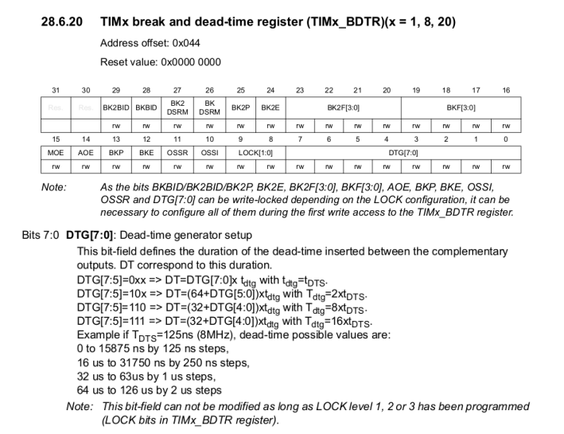

# TP_actionneur

2324_ESE3745 DALBIN Dorian-GOURDIN Gael

### Calcul du temps mort:
Le temps mort du transistor vaut 100 ns pour le temps d'allumage et 145 ns pour le temps d'extinction. On choisit donc un temps mort de 200 ns.
Pour calculer la valeur à mettre dans CubeIDE, on se base sur les formules suivantes:

On a Tdts = 1/(170 000 000), grâce à la formule DT=DTG[7:0]*Tdtg, on trouve que la valeur à entrer dans CubeIDE est 34.

### Calcul du duty cycle:
Pour determiner le duty cycle, il faut connaitre la résolution. On la calcule grâce à la formule résolution = LOG2(ARR). On a ARR = 4249 donc on a une résolution de 12 bits.
La valeur maximale que le compteur peut atteindre est 4095. Cett valeur correspond à un duty cycle de 1.

### Caractéristique du moteur
D'après la documentation, le capteur de vitesse sort 1V pour 1000tr/min.
La résolution de l'encodeur est de 4096.

### Asservissement
Kp = 0,354
Ki = 2,47
Kd = 0
